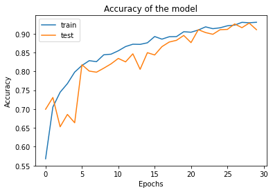
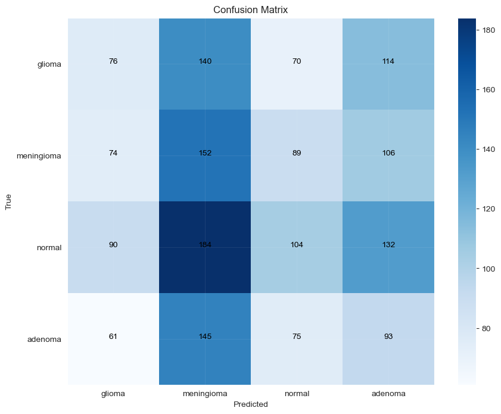

 TumorSense 

A deep learning-based project that utilizes artificial intelligence for the detection of brain tumors in medical images.

### Table of Contents
- [Introduction](#Introduction)
- [Dataset](#Dataset)
- [Model Architecture](#model-architecture)
- [Model Performance](#Model-Performance)
- [Conclusion](#Conclusion)
- [References](#References)

# Introduction

    A brain tumor is a mass or growth of abnormal cells in your brain.
    Many different types of brain tumors exist. Some brain tumors are noncancerous (benign), and some brain tumors are cancerous (malignant). Brain tumors can begin in your brain (primary brain tumors), or cancer can begin in other parts of your body and spread to your brain as secondary (metastatic) brain tumors.
    

    

### 1. Glioma
Glioma is a type of tumor that occurs in the brain and spinal cord. Gliomas begin in the gluey supportive cells (glial cells) that surround nerve cells and help them function. Three types of glial cells can produce tumors. A glioma can affect your brain function and be life-threatening depending on its location and rate of growth. Gliomas are one of the most common types of primary brain tumors.

    

### 2. Meningioma
A meningioma is a tumor that arises from the meninges — the membranes that surround the brain and spinal cord. Although not technically a brain tumor, it is included in this category because it may compress or squeeze the adjacent brain, nerves and vessels. Meningioma is the most common type of tumor that forms in the head.
Most meningiomas grow very slowly, often over many years without causing symptoms. But sometimes, their effects on nearby brain tissue, nerves or vessels may cause serious disability.

    

### 3. Pituitary Tumors (Adenoma)
Pituitary tumors are abnormal growths that develop in your pituitary gland. Some pituitary tumors result in too much of the hormones that regulate important functions of your body. Some pituitary tumors can cause your pituitary gland to produce lower levels of hormones. Most pituitary tumors are noncancerous (benign) growths (adenomas). Adenomas remain in your pituitary gland or surrounding tissues and don't spread to other parts of your body.

    

# Dataset
We collected a dataset of brain MRI images from openly available MRI datasets on Kaggle, HuggingFace,
we used ~10k images, 82% of the dataset is used for training, whereas 18% of the dataset is used for testing.  
Images are all scaled to 224 x 224, to improve the model's generalizability, data augmentation
strategies can be used to increase the diversity of the training sample when the dataset volume is small.

- Data collection 
<table style="margin-left: 2rem">
<thead>
    <th>Class</th>
    <th>Training Total</th>
    <th>Testing Total</th>
</thead>
<tbody>
    <tr><td>Glioma</td><td>1800</td><td>430</td></tr>
    <tr><td>Pituitary</td><td>2320</td><td>410</td></tr>
    <tr><td>Meningioma</td><td>2200</td><td>450</td></tr>
    <tr><td>Normal</td><td>2020</td><td>530</td></tr>
</tbody>
</table>

- Data Preprocessing and Augmentation

With the help of a series of preprocessing stages to
standardize the dataset so it could be used in classification problems.
Images were resized, this action guarantees that all the images were the same size.
Noise in the photos were reduced and the output quality was improved by using Gaussian filter.
the filtering softens the image while keeping important details. Images were sharpened
and complicated details features were extracted using High-pass filter and more.  

The success of the models is highly dependent on the training data's quality.
the lack of data is a common obstacle, because its expensive and time-consuming to collect useful data.  
Data augmentation methods have been created as a solution, they generate new data points from inside an existing dataset.
in order to increase its size. To improve the model's ability to generalize to new, unseen samples. 

We used Data augmentation to enhance MRI images. Model training was improved 

Total number of augmented training images: 50k.  
Total number of augmented training images: 11k.

# Model Architecture

    

# Model Performance

    

    

### Performance evaluation of deep learning models and our model

    <table>
        <thead>
            <th>Models</th>
            <th>Score (%)</th>
        </thead>
        <tbody style="text-align: center">
            <tr><td>Our first model (5m params)</td><td>85.7</td></tr>
            <tr><td>VGG16</td><td>87.2</td></tr>
            <tr><td>ResNet50</td><td>90.9</td></tr>
            <tr><td>Second Model (11.5m params)</td><td>93</td></tr>
            <tr><td>The proposed model</td><td>98</td></tr>
        </tbody>
    </table>

# Conclusion
To reduce global death rate, diagnosis of brain cancers is essential. Brain tumors can be difficult to identify
because of their complex architecture, size variability, and unusual forms
detect gliomas, meningioma, and pituitary brain tumors in MRI data.
Our suggested CNN model demonstrates the substantial influence of deep learning models in 
tumor identification and demonstrates how these models have changed this field.  
Our solution has low computational cost, making it usable on variety of applications and systems.
The results were improved with the help of data augmentation, even with a relatively small dataset
  We acknowledge that additional investigation and testing are essential to validate our results

Moreover, conducting rigorous performance evaluations will provide insights about the model. 

# References

<ol>
    <li>Çinar A., Yildirim M. Detection of tumors on brain MRI images using the hybrid convolutional neural network architecture. Med. Hypotheses. <a href="https://www.sciencedirect.com/science/article/abs/pii/S0306987720301717">[Science Direct]</a></li>
     
    <li>Tandel G.S., Tiwari A., Kakde O.G. Performance optimisation of deep learning models using majority voting algorithm for brain tumour classification. Comput. Biol. Med. <a href="https://www.sciencedirect.com/science/article/abs/pii/S0010482521003589">[Science Direct]</a></li>
     
    <li>Noreen N., Palaniappan S., Qayyum A., Ahmad I., Imran M., Shoaib M. A deep learning model based on concatenation approach for the diagnosis of brain tumor. <a href="https://ieeexplore.ieee.org/abstract/document/9025004">[IEEE Explore]</a></li>
     
    <li>Ottom M.A., Rahman H.A., Dinov I.D. Znet: Deep learning approach for 2D MRI brain tumor segmentation. <a href="https://ieeexplore.ieee.org/abstract/document/9779760">[IEEE Explore]</a></li>
     
    <li>Ahmad S., Choudhury P.K. On the performance of deep transfer learning networks for brain tumor detection using MR images. <a href="https://ieeexplore.ieee.org/abstract/document/9785791">[IEEE Explore]</a></li>
     
    <li>Generating Brain MRI Images with DC-GAN. <a href="https://www.kaggle.com/code/harshsingh2209/generating-brain-mri-images-with-dc-gan">[Kaggle]</a></li>
</ol>

